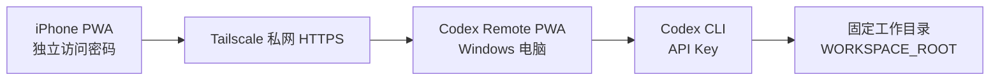

# Codex Remote PWA 使用教程

这套工具让 iPhone 通过私有网页控制电脑上的 Codex CLI。手机只登录本工具的密码；Codex 的 API Key、项目文件和会话记录始终留在电脑上。



## 1. 你将得到什么

- 用手机 Safari 或主屏幕 PWA 发起 Codex 任务。
- 每个「新任务」都有自己的 Codex session；继续发送消息会恢复同一个 session。
- 手机上的 ChatGPT 登录账号与此工具无关。
- API Key 不会出现在手机浏览器、页面源代码、URL 或远程接口响应中。
- 电脑端只允许 Codex 在 `WORKSPACE_ROOT` 指定的目录中工作。

## 2. 前置条件

在运行服务的 Windows 电脑上准备：

1. Node.js 20 或更高版本。
2. Codex CLI 已安装，并且 `codex --version` 能输出版本号。
3. 当前模型提供商的 API Key，或已经由系统服务环境变量提供的 `OPENAI_API_KEY`。
4. 要从外网以外的手机安全访问时，在电脑和 iPhone 安装并登录同一个 Tailscale tailnet。发行 ZIP 包含官方 Windows x64 安装程序 `installers\tailscale-setup-1.98.10.exe`；安装与登录需要互联网连接。

发行 ZIP 只包含运行文件、本说明和 `README.md`。将其解压到一个固定的本机目录，例如：

```text
C:\CodexRemotePWA
```

## 3. 创建正式配置

进入项目目录。发行 ZIP 已带有包含安全缺省值的 `.env`；其中没有 API Key、Cookie、会话或本机历史。首次双击 `Start-CodexRemotePWA.cmd` 会自动启动 `CodexRemoteSetup.exe`，以界面方式完成以下配置：

```powershell
cd C:\CodexRemotePWA
```

1. 生成并保存独立访问密码。
2. 选择允许 Codex 操作的工作目录和独立 `CODEX_HOME`。
3. 按需输入 API Key 并初始化本机 Codex API 登录。
4. 选择安全沙箱，并按需启用 Tailscale HTTPS、填写 HTTPS 地址和配置 `tailscale serve`。

也可以手动配置。先生成一个随机访问密码：

```powershell
node -e "console.log(require('node:crypto').randomBytes(24).toString('base64url'))"
```

编辑 `.env`。必须替换 `REMOTE_PASSWORD`；默认的 `WORKSPACE_ROOT=.` 仅允许 Codex 操作当前解压目录，也可按需改为独立工作目录：

```text
REMOTE_PASSWORD=上一步生成的随机密码
WORKSPACE_ROOT=C:\CodexWorkspaces\my-project
```

如果提供商凭据没有由系统环境变量提供，再在同一个 `.env` 中添加：

```text
OPENAI_API_KEY=你的_API_Key
```

不要把 API Key 写进 `public` 目录、浏览器页面、截图或 URL，也不要将配置后的 `.env` 复制给其他电脑。

### 与 Codex Desktop 账号隔离

如果你的 Codex Desktop 使用 ChatGPT 账号，而本服务必须使用 API Key，请额外设置一个独立目录：

```text
CODEX_HOME=C:\CodexRemoteData\codex-home
```

服务进程会使用这个独立的 Codex 状态目录。Desktop App 继续保留原来的 ChatGPT 登录和历史记录，不需要切换账号。远程 PWA 的 Codex session 也会在这个目录中保存。

为该独立目录初始化提供商登录：

```powershell
npm run auth:api
```

看到 `Codex API authentication initialized` 后再通过手机发送任务。若仍被拒绝，请检查 API Key、Codex CLI 与对应的本机配置；不要使用 ChatGPT 会话令牌。

## 4. 本机启动和验证

推荐双击项目根目录的 `Start-CodexRemotePWA.cmd`。默认 `.env` 尚未配置时，它会先运行独立的 `CodexRemoteSetup.exe`；完成向导后再次启动会打开 `CodexRemoteConsole.exe`，再点击“启动服务”。控制台可显示 PWA 与 Tailscale 状态、查看服务日志、打开配置向导和帮助文档；它不会创建 Windows 自启动任务。

若需直接在前台排错，启动服务：

```powershell
npm start
```

正常情况下会显示：

```text
Codex Remote is listening on http://127.0.0.1:8787
```

在这台电脑的浏览器访问 `http://127.0.0.1:8787`，输入 `REMOTE_PASSWORD`。创建一个「新任务」后，发送一条低风险的验证提示，例如：

```text
请概述当前工作目录的顶层文件，不要修改任何文件。
```

第一条消息会创建 Codex session。后续继续在同一任务里发送消息时，工具会自动恢复该 session，而不是创建新的上下文。

服务启动后，终端窗口需要保持运行。修改 `.env` 后必须停止服务并重新执行 `npm start`，配置才会生效。

## 5. 使用 Tailscale 安全地从 iPhone 访问

不要将 8787 端口映射到路由器，也不要把服务直接绑定到公网 IP。保持 PWA 只监听 `127.0.0.1`，由 Tailscale Serve 提供私有 HTTPS 入口。

1. 若电脑尚未安装 Tailscale，运行 `installers\tailscale-setup-1.98.10.exe`。安装完成后在 Tailscale 窗口登录自己的 tailnet；这一步由 Tailscale 官方客户端完成，本项目不会代为保存登录信息或修改 Tailscale 的自启动设置。
2. 在 iPhone 安装 Tailscale App，并登录同一个 tailnet。
3. 电脑端确认 Tailscale 已连接，并先确认 PWA 已在本机 `127.0.0.1:8787` 运行。
4. 在电脑终端启动 Tailscale Serve：

```powershell
tailscale serve --bg 8787
```

5. 执行 `tailscale serve status`，记录输出的 `https://<设备>.<tailnet>.ts.net` 地址。
6. 若状态中没有 HTTPS listener，先在 [Tailscale DNS 管理页](https://login.tailscale.com/admin/dns) 为当前 tailnet 启用 HTTPS certificates，然后再次执行第 4 步。
7. 在 `.env` 中启用 HTTPS Cookie 与可信本机反向代理：

```text
COOKIE_SECURE=1
TRUST_PROXY=1
PUBLIC_ORIGIN=https://<设备>.<tailnet>.ts.net
```

8. 重启 `npm start`，再用 iPhone Safari 打开该 HTTPS 地址。

当前版本中，`tailscale serve --bg 8787` 的默认模式为 HTTPS。若 HTTPS certificates 尚未为 tailnet 启用，HTTPS listener 无法创建。可临时执行 `tailscale serve --http=80 --bg 8787` 提供仅限 tailnet 的 HTTP 回退，但这不能作为可安装 PWA 的正式入口。

将 `<设备>.<tailnet>.ts.net` 替换为 Serve 输出的 HTTPS 域名。`PUBLIC_ORIGIN` 会在 Tailscale 反向代理改写 `Host` 时仍正确校验手机请求的 Origin。

`TRUST_PROXY=1` 只适用于 Tailscale Serve 这类电脑本机可信的 HTTPS 反向代理。不要在把 Node 服务直接公开到互联网的情况下启用它。

## 6. 安装到 iPhone 主屏幕

1. 在 iPhone Safari 打开 Tailscale HTTPS 地址并登录 Remote Codex。
2. 点 Safari 的分享按钮。
3. 选择「添加到主屏幕」。
4. 以后从主屏幕启动即可。

PWA 会缓存界面外壳，但真正的任务、会话和 Codex 执行仍需要 iPhone 能通过 Tailscale 连接电脑。

## 7. Windows 手动启动

双击项目根目录的 `Start-CodexRemotePWA.cmd` 打开本机控制台，在其中启动或停止 PWA、管理 Tailscale 并打开本教程。该入口优先启动项目内的 `CodexRemoteConsole.exe`，可避免 PowerShell 隐藏窗口导致控制台未显示的问题。Tailscale 启停会要求管理员确认。

也可在 PowerShell 中以前台方式执行：

```powershell
.\scripts\start-codex-remote.ps1
```

控制台启动的 PWA 会在后台运行；关闭控制台不会停止已经启动的服务，需点击“停止服务”。前台方式则需要保持该窗口运行，按 `Ctrl+C` 或关闭窗口会停止服务。项目不会注册 Windows 登录或开机自启动任务。

## 8. 日常工作方式

| 你的操作 | 工具行为 |
| --- | --- |
| 点击「新任务」 | 创建一个独立的远程任务记录。 |
| 在新任务发送第一条提示 | 启动 `codex exec --json` 并保存返回的 session ID。 |
| 在同一任务继续对话 | 执行 `codex exec resume <session-id>`，保留上下文。 |
| 点击「中止」 | 停止当前正在运行的 Codex 进程。 |
| 回到旧任务 | 阅读该任务的消息和运行状态；继续发送会续接原 session。 |

PWA 的索引记录保存在 `data/threads.json`，包括任务标题、消息副本、状态和 Codex session ID。实际 Codex session 记录在 `CODEX_HOME` 或默认的 Codex 用户目录中。备份这两个位置才能完整保留远程历史。

## 9. 安全边界

1. 使用至少 24 字节随机密码，不要复用 ChatGPT、邮箱或 Tailscale 的密码。
2. 只用 Tailscale 私网访问，不开放路由器端口，不使用公开反向代理。
3. 保持 `WORKSPACE_ROOT` 指向你愿意让 Codex 修改的单个项目目录。
4. 保持默认的 `CODEX_SANDBOX=workspace-write`；不要为了方便启用跳过审批或跳过沙箱的危险选项。
5. 不把 API Key 输入到手机页面。若怀疑 Key 泄露，立即在 OpenAI 平台撤销并替换。
6. 手机丢失时，先在 Tailscale 控制台将该设备从 tailnet 移除，再更换 `REMOTE_PASSWORD`。

## 10. 常见问题

### 8787 端口已被占用

改用一个未占用端口：

```text
PORT=8790
```

重启服务，并把 Tailscale Serve 的目标改为 `http://127.0.0.1:8790`。

### 页面能登录，但发送任务后显示错误

先查看运行 `npm start` 的终端输出。通常是以下原因之一：

- 当前提供商的 `OPENAI_API_KEY` 没有提供，或已失效。
- Codex CLI 没有安装在服务账户的可执行路径中。
- `WORKSPACE_ROOT` 已移动、删除或没有访问权限。
- `CODEX_HOME` 指向的目录没有权限创建或读取文件。

### 服务提示找不到 Codex CLI

在 `.env` 设置 Node 可执行文件和 Codex 入口文件，中间用竖线分隔：

```text
CODEX_COMMAND=C:\Program Files\nodejs\node.exe|C:\path\to\@openai\codex\bin\codex.js
```

路径按你机器上的实际安装位置替换。修改后重启服务。

### iPhone 能打开页面但登录后立刻退出

这通常是 HTTPS Cookie 设置与访问方式不匹配：

- 本机 `http://127.0.0.1:8787` 验证时，不设置 `COOKIE_SECURE=1`。
- 通过 Tailscale HTTPS 地址访问时，设置 `COOKIE_SECURE=1` 和 `TRUST_PROXY=1`，然后重启服务。

### 如何确认安装后的服务可用

发行 ZIP 不包含开发测试文件。启动服务后，在电脑浏览器打开 `http://127.0.0.1:8787`，使用 `.env` 中设置的独立密码登录；创建一个新任务并发送低风险提示即可确认会话创建和续接可用。
